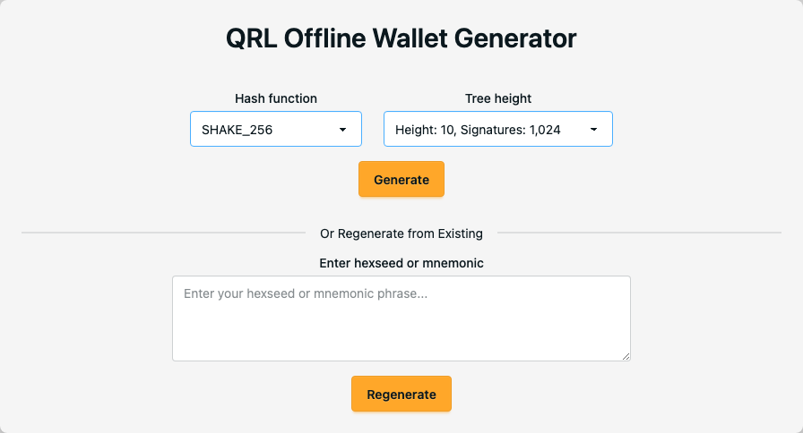
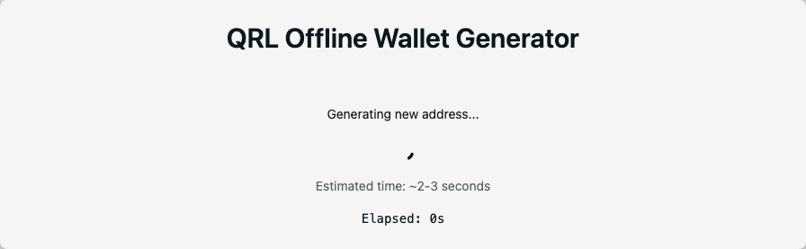
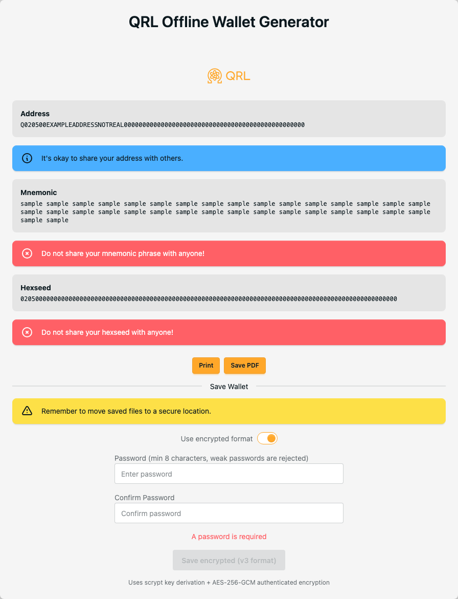
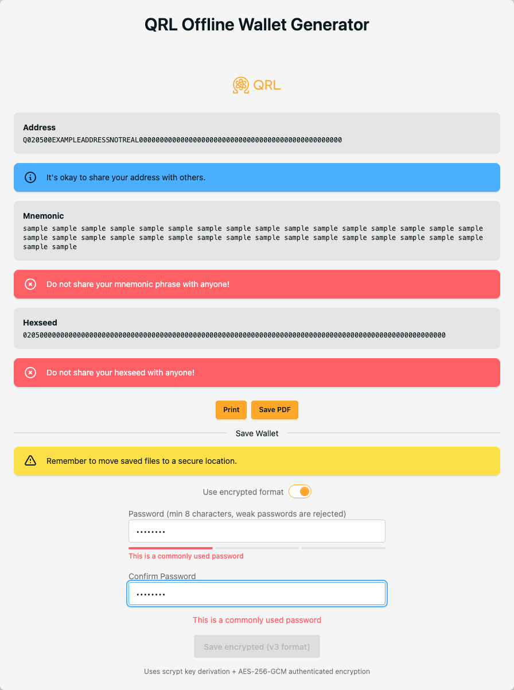
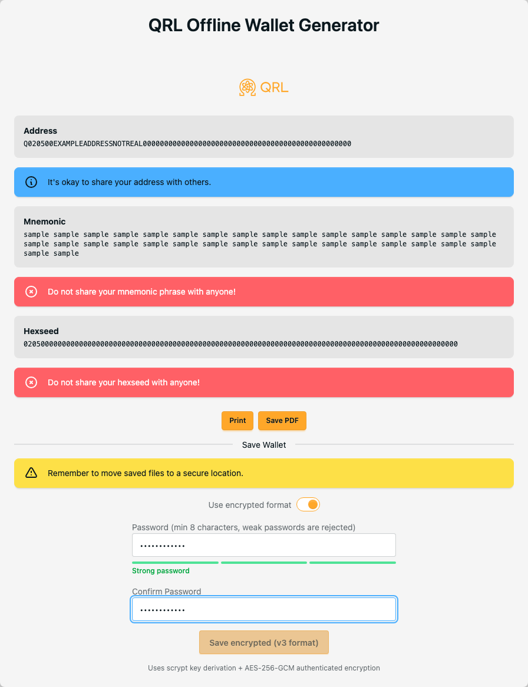
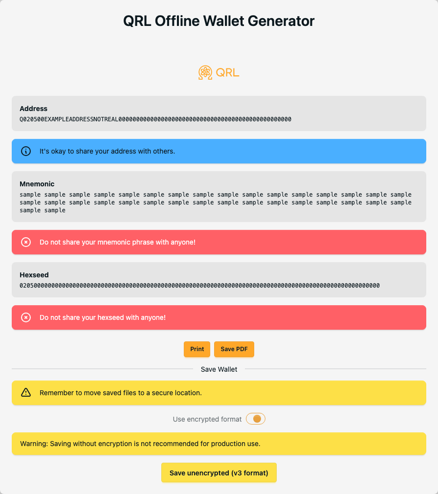

> [!NOTE]
> This code relates to version 1.x of QRL, the world's first open-source PQ blockchain, which has been securing digital assets since December 2016.
> The next generation of QRL, version 2.0, is in development and has its own repositories. See [this discussion page](https://github.com/orgs/theQRL/discussions/2).

# QRL Offline Wallet Generator

Use the [deployed wallet](https://offline-wallet-generator.theqrl.org), or for an air-gapped workflow download the latest signed, single-file [offline release](https://github.com/theQRL/offline-wallet-generator/releases/latest).

## Use (the quick version)

- Download the latest **qrl-offline-wallet-&lt;version&gt;.html** and its `.sha256` file from [GitHub Releases](https://github.com/theQRL/offline-wallet-generator/releases/latest)
- Verify the checksum as described on the release page
- Disconnect the machine from the network
- Open the HTML file in a modern browser (one which [supports WebAssembly](https://caniuse.com/#feat=wasm)); no server or install is required

**then**:

- Generate a wallet with the required settings (see [docs.theqrl.org](https://docs.theqrl.org))
- Save JSON/print/save PDF and print later
- No internet connection required

Help is available:

- [Discord community](https://discord.gg/jBT6BEp)
- <support@theqrl.org>

## Verify integrity (recommended before you generate anything)

The whole point of this tool is that you are running the code the source says
you are running. Two checks establish that; a third is stronger still.

**1. Checksum — confirms the download is not corrupted.**

```bash
sha256sum -c qrl-offline-wallet-<version>.html.sha256
```

This is produced by the same job that built the file, so it tells you the
download arrived intact and nothing about who built it.

**2. Build provenance — confirms the file came from this repository's release
pipeline.** Requires the [GitHub CLI](https://cli.github.com).

```bash
gh attestation verify qrl-offline-wallet-<version>.html --repo theQRL/offline-wallet-generator
```

The attestation is signed during the release run and binds the file's digest to
this repository, the workflow, and the commit it was built from. **This is the
check to run.**

**3. Rebuild it yourself — confirms the file matches the source.** See
[RELEASE.md](RELEASE.md#3-rebuild-and-compare--detects-anything-at-all) for the
exact procedure, including why a `git clone` is required and why the digest is
only guaranteed to match on Linux x64.

> Earlier releases were verified through a PGP-signed checksum manifest in the
> `theQRL/security` repository. That pipeline has been replaced; releases now
> carry the attestation described above instead. If you are following older
> instructions and cannot find `shasum.256.pgp.asc`, that is why.

## Use (the longer version - with pictures)

This software will allow you to generate a wallet for use on the QRL network.  For security, it is designed to be used in an offline environment.  It is recommended to use this software from a bootable OS (e.g. Desktop Ubuntu distribution) without any network connection.

You can configure the wallet to be generated using the dropdowns. The defaults are fine for most users. You can read more about the tree height and hash function options at [the QRL docs site](https://docs.theqrl.org/wallet/basics/#qrl-web-wallet). Bear in mind that large tree heights will need longer to generate, especially on older computers. Once the options have been reviewed, click **Generate** to begin.



The software uses the core QRL library (QRLLIB), which requires a modern browser with WebAssembly support. If it has loaded correctly, the QRLLIB version and a check mark are shown in the footer.

A spinner shows while the wallet is being created, with an estimate and an elapsed timer. Please be patient: generating an address may take up to 30 minutes on old hardware if the largest tree height has been selected. On modern hardware with the default options it usually takes only a couple of seconds.



The generated wallet can be printed, saved as a PDF, or exported as JSON in either password-protected or unprotected form. Both JSON formats can be used in the QRL web wallet; the unprotected format can also be used in a QRL node. If you choose the password-protected option — recommended in most cases — do not forget the password, as funds may be lost if you do.



> The address, mnemonic and hexseed shown above are placeholders, not a real wallet.

Weak passwords are refused rather than merely flagged. Common passwords, keyboard patterns and repeated sequences will not enable the save button, and the reason is shown beneath the field.



The **Save encrypted** option becomes available once the passwords match and are strong enough.



If you untick the option to use the password-protected file format, the **Save unencrypted** option becomes available instead.



Whichever option you choose, guard the mnemonic phrase, hexseed and private key carefully: sharing these details could result in loss of funds.

## Developing/Building from source

### Requirements

- Node.js — the version in [`.nvmrc`](.nvmrc) (`nvm use`)
- npm

### Project setup

```bash
npm install
```

### Develop

```bash
npm run dev
```

### Build

```bash
npm run build           # hosted site -> dist/
npm run build:offline   # single-file offline release -> dist-offline/index.html
npm run check:offline   # assert the offline artefact is self-contained
```

### Test

```bash
npm test                # unit tests (node --test)
npm run test:browser    # Playwright: loads the offline artefact from file://
                        # with the network denied and proves it generates a
                        # wallet without attempting a single request
npm run lint            # ESLint
npm run build:verified  # everything above that gates a deploy, in order
```

`npm run test:browser` requires the offline artefact to exist — run
`npm run build:offline` first.

### Security

- Format specification: [docs/v3-wallet-format.md](docs/v3-wallet-format.md)
- Release and verification process: [RELEASE.md](RELEASE.md)
- Reporting a vulnerability: [SECURITY.md](SECURITY.md)
